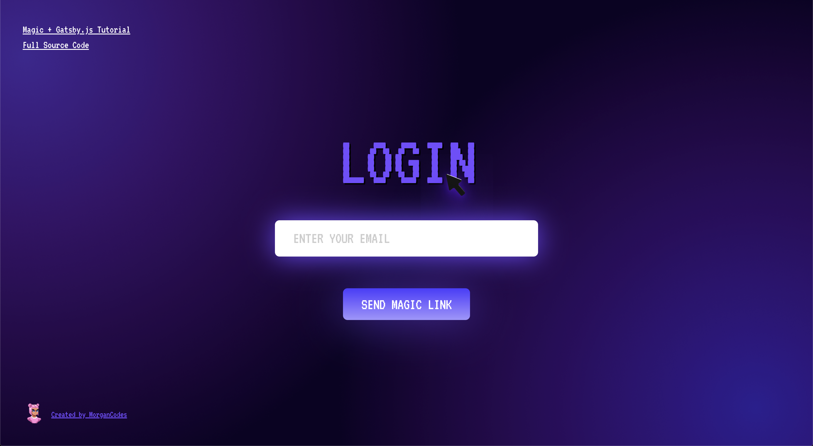

# Plug + Play Passwordless Authentication with Magic and Gatsby.js

[](https://app.netlify.com/sites/magic-gatsby/deploys)

✨ View the app live in production [here](https://magic-gatsby.netlify.app)

## 💻 An Enhanced Developer Experience

[Magic](https://magic.link/) is a developer SDK that you can integrate into any application to enable blazing-fast, hardware-secured passwordless authentication with just a few lines of code (even if you already have an existing auth solution). The Magic SDK currently offers support for [32+ ecosystems](https://docs.magic.link/#start-building) — from Social Logins like Google, Facebook, and Github to Blockchains like Ethereum, Polkadot, and Solana.

Here's how it works:

When a user wants to sign up or log in to your application:

1. User requests a **magic link** sent to their email address
2. User clicks on that magic link
3. User is securely logged into the application
   [Gatsby.js](https://gatsbyjs.com) is a [React](https://reactjs.org/)-based static site generator powered by [GraphQL](https://graphql.org/learn/). Gatsby essentially takes the best parts of React, Webpack, GraphQL, and various front-end tools to provide a seamless developer experience. If you're new to Gatsby, you can learn more from their documentation [here](https://www.gatsbyjs.com/docs).

In this tutorial, we'll demonstrate just how easy it is to get started integrating with Magic in just a few lines of code.

## 🛠 What We'll Build


In this tutorial we'll be integrating Magic to a static Gatsby.js site and deploying it to Netlify. Feel free to follow along the tutorial on Medium here.

## Step 1: Clone the Starter Template & Install Dependencies

`git clone https://github.com/morganrmarie/passwordless-authentication-tutorial.git`

Change to the tutorial's directory:

`cd passwordless-authentication-tutorial`

And install the project's dependencies from the root directory:

`cd dev && npm install`

`cd prod && npm install`

If you'd like to try the final application, you can run the production application locally from the root folder:

`npm run start:prod`

Otherwise, to follow along with the tutorial, spin up the development server (also from the root folder):

`npm run start:dev`

## Step 2: Initialize Magic

Before we get started integrating Magic into our application, I recommend you take a look at [Magic's documentation](https://docs.magic.link/). They've got easy-to-follow documentation and helpful [guides](https://magic.link/guides) on other most commonly used developer tools.

The starter template for this tutorial lies in the `dev/` directory of this tutorial's codebase. To begin integrating Magic, we'll need to install the Magic Client SDK in the `dev/` directory:

`npm install --save magic-sdk`

By default Gatsby supports two environments: **development** and **production**. To support both environments, we'll create two files in the root of the `dev/` directory: `.env.development` and `.env.production`. Copy the contents (it's only one variable) of `.env.example` to both files.

Before we initialize Magic, you'll need to sign up to the [Magic Dashboard](https://dashboard.magic.link/signup) to get your own API keys. Replace `GATSBY_MAGIC_PUBLISHABLE_API_KEY` in .env.development and .env.production with your "Publishable API Key" from the [Magic Dashboard](https://dashboard.magic.link/signup).
Now that we've set our environment variable, we can create an SDK instance to initialize Magic.

Because Gatsby generates static HTML at build time when you run `gatsby build`, we need to ensure the global `window` object is defined before importing Magic.

We'll initialize Magic in the `src/lib/magic.js` file like so:

```jsx
import { Magic } from "magic-sdk"

let magic

if (typeof window !== `undefined`) {
  magic = new Magic(process.env.GATSBY_MAGIC_PUBLISHABLE_API_KEY)
}

export { magic }
```

## Step 3: Handle Authentication

Navigate to the `index.js` file in `src/pages` and import your newly-created Magic instance.

```jsx
import { magic } from "../lib/magic"
```

Next, we'll implement our login & logout methods. Handling user sessions is made incredibly easy with Magic. Add these two methods to the same `index.js` file.

```jsx
// Handle login with email
const handleEmailLogin = async (e) => {
  // Get the current value from the input field
  const email = userEmail.current.value
  if (!email) return

  try {
    // Login with Magic ✨
    await magic.auth.loginWithMagicLink({
      email
    })

    // Set user metadata
    let userMetadata = await magic.user.getMetadata()
    setUser(userMetadata)
  } catch (error) {
    console.error(error)
  }
}

// Handle logout
const handleLogout = async () => {
  // Logout with Magic
  await magic.user.logout()
  setUser(null)
}
```

In our `useEffect` hook, we'll check if the user is logged in and set their metadata if they are. If not, we'll set the user to `null`.

```jsx
useEffect(() => {
  // Check if user is logged in
  magic.user.isLoggedIn().then((isLoggedIn) => {
    return isLoggedIn
      ? // If user is logged in, set metadata
        magic.user.getMetadata().then((userData) => setUser(userData))
      : setUser(null)
  })
}, [])
```

## Step 4: Deploy

Deploying the application is **completely optional**, but I'm personally a big fan of [Netlify](https://www.netlify.com/) and

Once you register and connect your Netlify account to your Github, you can configure auto-deployments from the branch of your choice. If you choose to do this, set your build command as `gatsby build` and the public directory to `public`.

Don't forget to set the `GATSBY_MAGIC_PUBLISHABLE_API_KEY` environment variable with your publishable API key from the [Magic Dashboard](https://dashboard.magic.link/signup).
